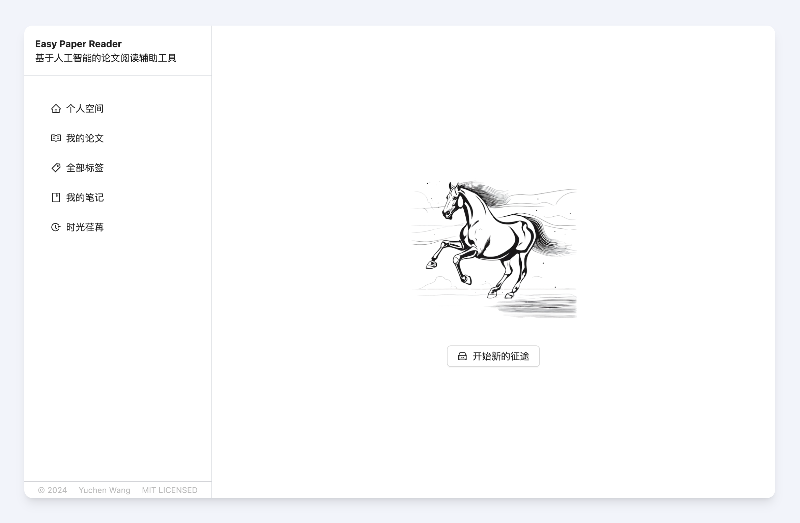
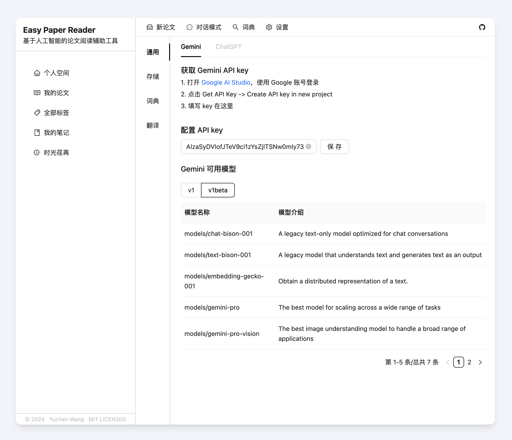
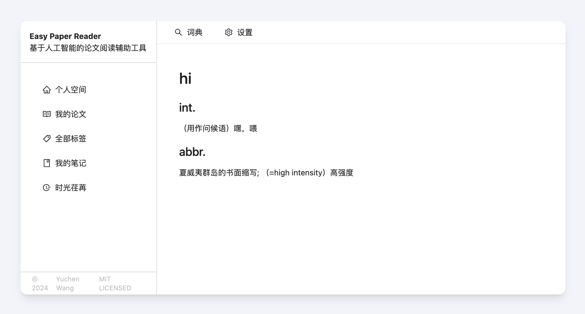

# Easy Paper Reader

项目的初衷是为了更好阅读论文，基于 AI 原生提升体验。技术栈是 Vite + React + Antd + Redux + Tailwind，目前是个纯前端项目。数据通过 localforage 存储在浏览器本地。目前的 AI 接口使用的是免费的 Gemini API。目前还非常早期，也使用了一些第三方的翻译和查词接口。

## Screenshots

### Home Page

### Gemin Setting Page

### Word Page

